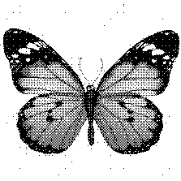

# go-haftone 

This repository contains a implemenation of "digital halftoning" algorithm written in go. 

Halftone is the reprographic technique that simulates continuous-tone imagery through the use of dots, varying either in size or in spacing, This technique is used by the printer to convert digital image (see more [here](https://en.wikipedia.org/wiki/Halftone))


### usage

Type `go run cmd/haftone.go --help` to check the option supported.

```
Usage:
			go run <image>
Options:
  -method string
    name of the filters to apply, options: 'bayer', 'bayer2', 'bayer4' (default bayer2)
  -output string
		Directory name, where to save the generated images (default "output")`
```


### example

example of result:

| Filter|  Input  |  Output |
|:--:|:--:|:--:|
|bayer|||
|bayer2|||
|bayer4|||


